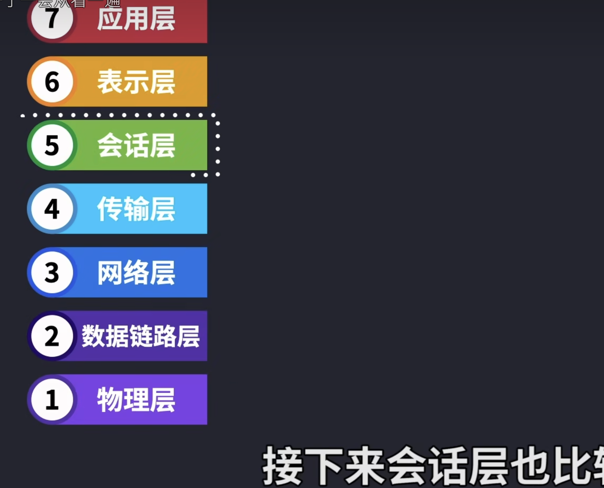

### HTTP是什么

```
HTTP（超文本传输协议）是互联网上用来传递信息的一种规则。可以把它想象成一种通讯方式，它定义了如何发送和接收网页内容，比如文本、图片和视频等。

想象一下，当你在网上浏览器里输入一个网址或点击一个链接时，你的浏览器就通过HTTP向网站的服务器发送一个请求，就像是在说：“嘿，我想看这个网页。”服务器收到这个请求后，如果网页可用，它就用同样的HTTP规则回应，发送网页的内容回来。

简单来说，HTTP像是你和网站之间的对话规则，确保双方都能理解对方发送的消息。这就是你能够浏览网页和观看在线视频的原因之一。
```

### OSI七层网络参考模型



```
根据视频总结一下
7.应用层 为应用程序提供网络服务：
用户app里面的数据，图片，声音，文字

6.表示层 数据格式化，加密，解密：
对app数据进行加密，就是相当于独创一套编码方式，只有自己人才知道解码方式，则可以实现数据加密
我们看到的，听到的，都是用计算机的编码来表示
用bmp，jpeg编码来表示图片数据
用wav或mp3编码来表示声音数据
用wmv或avi编码，来表示视频数据

5.会话层 建立，维护，管理会话连接：
两个app之间的会话，是否可以对接

4.传输层 建立，维护，管理端到端连接：
两个端之间建立tcp、udp连接，对数据完整性要求高使用tcp，保障数据传输的完整性 ，但是成本比udp高，速度慢，语音视频这类实时采集的数据，没有文件完整性一说，而是采集多少就传输 多少，就用udp

3.网络层 ip寻址和路由选择
路由技术是网络工程师核心技术之一，直接影响到各个互联网app的应用体验
使用的协议统一，网络层基于IP地址进行路由转发

2.数据链路层 控制网络层和物理层之间的通信
数据链路层协议由很多种协议，解决各端链路之间的协议标准
每台路由器之间的链路使用的协议都有可能不一样，比如说以太网协议（适合广播型协议），帧中继协议，ppp协议（适用于点到点），802.11协议（适合无线网络），为了让整个网络的性能更加强大，可以在不同的链路段使用不同的协议

1.物理层 比特流传输
```