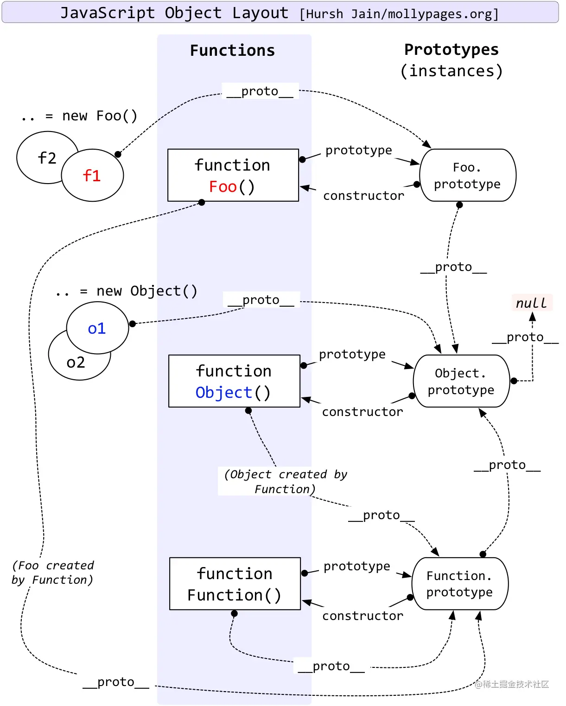

### 原型和原型链
总结：
- 原型：每一个JavaScript对象(null除外)在创建的时候就会与之关联另一个对象，这个对象就是我们所说的原型，每一个对象都会从原型“继承”属性，其实就是prototype对象。
- 原型链：由相互关联的原型组成的链状解构就是原型链

- [JavaScript 深入之从原型到原型链 ](https://github.com/mqyqingfeng/blog/issues/2)
- [深入理解 JavaScript 作用域和作用域链](https://juejin.cn/post/6844903989088092174)